<<<<<<< HEAD
# AppiumMobile
=======
# Appium tutorial

# Beginner

## Mobile testing introduction

**Mobile devices** are typically handheld computers. They have many variants based on their characteristics such as physical dimension, hardware and software capability, what are they meant for, etc. `m1`

- **Smartphones**
- **Tablets**
- **E-book Readers**

### Native applications

A **native application** is developed <mark>specifically for one platform</mark>. It can be installed through an application store (such as Google Play Store or Apple’s App Store). `m1`

Native apps — apps built using the native mobile SDKs and APIs.

### Hybrid applications

They can be well described as a **mixture** of Web App and Native App.  Hybrid Apps are a way to expose content from existing websites in App format. T`m1`

Hybrid apps — apps with a native container and one or more **webviews** embedded in that container. The webviews are little frameless browser windows that can show content from the web or from locally-stored HTML files.

### Mobile Web applications

Web applications are not real applications; they are actually websites that open in your smart-phone with the help of a web browser. `m1`

Web applications = websites accessed using a mobile browser.

### Real Devices vs Emulator Vs Simulator

There are 2 main types of devices for testing:  `m2`

- **real testing devices** and 
- **virtual testing devices** (emulator and simulator)

**Real testing devices** are actual handsets used by end-users outside the testing environment. For the purpose of testing, the team usually acquires mobile devices in great variety in models, OS, OS versions, screen sizes, etc. Testing on these devices also allows testers to check the functionality and behavioral pattern of the application. `m2`

**Simulators** are virtual testing software built for **different operating systems** for a specific purpose. ***They are basically made for iOS devices*** (iPhone and iPad) since they are not like Android devices, which are easy to emulate. The iOS simulator imitates the iOS and runs the required application within the environment by taking charge of the computer’s operating system. Besides, iOS simulators work on macOS only because the simulator needs Apple’s native Cocoa API (a library of frameworks to handle GUI, runtime, and other operations). Therefore, testers must use either MacBook or virtualized macOS on their systems. Also, these simulators cannot imitate hardware, and some functionalities (battery state, motion sensor, and cellular interrupts) cannot be tested with it. `m2`

**Emulators** are virtual testing software on a computer ***that imitates both the software and hardware configuration*** of a mobile device or another computer. It works on an ISA (Instruction Set Architecture), which is written in machine language that the processor understands. The emulator imitates the target (mobile device) processor by translating its ISA into the one used by the system through the binary translation process. This helps the computer to create a reliable virtual testing environment. Some examples of the widely used emulators for testing are Android emulators, iPhone emulators, etc. Emulators are also making moves in the [mobile cloud testing](https://www.katalon.com/resources-center/blog/mobile-cloud-testing/) field with the availability of cloud-based android devices. `m2`

|     | Real                                                                                                                                                  | Virtual                                                                                                                                                                                       |
| --- | ----------------------------------------------------------------------------------------------------------------------------------------------------- | --------------------------------------------------------------------------------------------------------------------------------------------------------------------------------------------- |
| ➕   | Testing on real devices is more reliable because it allows testers to test almost all possible real-time scenarios.                                   |                                                                                                                                                                                               |
| ➕   | Real testing devices can easily simulate battery issues, incoming interrupts, exact color, and brightness displays.                                   |                                                                                                                                                                                               |
| ➖   | Real testing devices are costly compared to the emulator/simulators.                                                                                  |                                                                                                                                                                                               |
| ➖   | Due to the wide variety of handsets to work with, testing on real devices can be challenging, especially when teams are working on a tight timeframe. |                                                                                                                                                                                               |
| ➕   |                                                                                                                                                       | virtual devices are free software                                                                                                                                                             |
| ➕   |                                                                                                                                                       | Virtual devices are easier to test when testers are not sure of the mobile devices to choose from among the wide variety available, or when they are working on a budget or deadline related. |
| ➕   |                                                                                                                                                       | Capturing screenshots of the situations where defects appear is very easy                                                                                                                     |
| ➖   |                                                                                                                                                       | Virtual devices may generate both false positive and false negative results                                                                                                                   |
| ➖   |                                                                                                                                                       | Although they mimic real devices, they cannot cover all its features such as push-up notifications, battery, camera, etc.                                                                     |
| ➖   |                                                                                                                                                       | Results obtained from testing on virtual devices may not be as accurate as expected.                                                                                                          |

One thing is self-explanatory in case of mobile testing. To perform mobile testing, **you need a mobile device**. This is to access that how our product will work and look like on a given mobile set. Once the product is entirely developed, as a part of mobile testing, we need to check if the application is working as expected with all the majorly used devices like Android phones, iOS, Blackberry phones, and other different types of tablets and iPads. To do this kind of check, we need to acquire each such device and then we can check if the application behaves as per expectation. So is there any smart alternate available? The solution to this problem is to use Mobile Simulators and Mobile Emulators. These are primarily software programs designed to provide simulation for important features of a smartphone. They are very similar in nature, so sometimes, they are used interchangeably. `m1`

A simulator/emulator **cannot** mimic the following features `m1`

- Mobile device battery
- Mobile device’s camera
- Difficult to mimic interruptions like incoming calls and SMS.
- Not so much realistic simulation for mobile device memory usage.

### Technology Protocol

Selenium and Appium use the same protocol; **JSON Wire protocol.** This protocol recently became a standard W3C protocol. Today, many industries, as well as browser providers, are implementing it as a standard protocol. `m3`

### Environmental differences

It is important to understand the **environmental differences** between mobile devices and **browsers**.

- **Gestures:** Mobile devices use different input options or gestures such as swiping, pinching, two-finger touch, multi-finger touch, etc. which is not available in web browsers.
- **Different URL system:** Mobile apps are specific to mobile devices wherein you don't have regular web URLs.
- **Real Devices & Emulators:** You test on real devices and simulators. For Android, you use the same apks for both options. However, in iOS, you use different technologies for real devices and simulators because simulators run on x64 while real devices use arm processors. So, you'll have to perform testing on both options.
- **Buttons:** Mobile devices come with buttons such as Home, power, and volume. You have to consider them while testing.
- **Home Screen:** Mobile devices have a Home screen with a notification bar. So, interactions on the home screen should be considered.
- **Rotating Screen:** Mobile screen can be changed to portrait and landscape wherein the screen size changes.
- **Different Network Connections:** The network conditions such as 2G, 3G, 4G, 5G should be considered. Especially functional testing should be done at different internet speeds.

When it comes to **applications**, mobile apps are different from their web counterparts:

- **Application Lifecycle:** The mobile app lifecycle is different and complex. You can install, uninstall, launch and close apps.
- **Stateful navigation:** Mobile apps remember your session and respond accordingly when you login the next time. It is more stateful. Navigation is simple too
- **DOM UI technologies:** are different for iOS and Android
- **Client-side scripting:** such as JavaScript is not available in mobile apps
- **Debugging tool:** (eg: F12 in Chrome) is not available.

### Mobile Testing Frameworks Overview

A testing framework or more specifically a testing automation framework is an execution environment to perform automated tests.

| ID  | Framework   | Decription                                                                                                                                                                                               | Scripting language | Android | IOS |
| --- | ----------- | -------------------------------------------------------------------------------------------------------------------------------------------------------------------------------------------------------- | ------------------ | ------- | --- |
| 1   | **Appium**  | an open-source test automation framework to test **native** and **hybrid** apps and mobile **web** apps.                                                                                                 | Almost any         | ✔️      | ✔️  |
| 2   | Selendroid  | can be used to functionally test your Android applications. Apparently, if you are used to Selenium, Selendroid should be an easy way to use your knowledge to create your functional tests for Android. | Java               | ✔️      | ❌   |
| 3   | UIAutomator | UIAutomator is a test framework by Google that provides advance UI testing of native Android apps and games.                                                                                             | Java               | ✔️      | ❌   |
| 4   | Robotium    | an open-source test framework for developing functional, system nd acceptance test scenarios. It is very similar to Selenium.                                                                            | Java               | ✔️      | ❌   |
| 5   | Calabash    | Calabash is a functional testing framework, one of the easiest frameworks to use and even non-developers should be able to create functional tests using it.                                             | Ruby               | ✔️      | ✔️  |
| 6   | Zucchini    | an open-source visual functional testing framework for iOS applications based on Apple UIAutomation.                                                                                                     | ?                  | ❌       | ✔️  |

...

<br/>

## What is appium...

> Appium is an open source **test automation framework** for use with native, [hybrid](https://appium.io/docs/en/writing-running-appium/web/hybrid/) and mobile web apps. It drives iOS, Android, and Windows apps using the WebDriver protocol. `a2`
> 
> ⚠️ **Native applications** are those written for specific platform - using the iOS, Android, or Windows SDKs. **Mobile web applications** are just web applications accessed using a mobile browser. **Hybrid applications** have a wrapper around a "webview" -- a native control that enables interaction with web content. 

**Appium** is a ***mobile test automation framework*** for **native**, **hybrid** and **mobile web** apps for iOS and Android. It uses `JSONWireProtocol` internally to interact with iOS and Android apps using [Selenium’s WebDriver](http://docs.seleniumhq.org/projects/webdriver/). The framework is basically a wrapper that translates **Selenium Webdriver** commands into UI Automation (iOS) or uiautomator (*Android, API level 17 or newer*) or [Selendroid](http://selendroid.io/) (*Android, API level 16 or lower*) commands depending on the device type.

...

## Appium Architecture & inner workings...

The Appium architecture is pretty similar to that of Selenium. Appium also allows Selenium mobile testing developers to write code in multiple languages such as Java, PHP, C#, Python, Ruby, Javascript (WebdriverIO), and Javascript (WD). However, Appium implements other options too. For instance, when you use Java, it inherits from the RemoteWebDriver. The Appium server can be installed on the machine or in the cloud. When the createSession() command is executed from the Appium client over the JSON Wire protocol, the Appium Server creates a new session on the mobile device via the Appium driver (Android driver / iOS driver). For Android devices, it uses the Android ADB infrastructure. It will create APKs on the machine if required. For iOS, it will use the mobile IDE framework and communicate with the command line. `a1`


Appium consists of mainly below four stages to function.

- **Appium Client Library**: Appium client libraries such as python,Java, Java script , C# and Ruby etc. Whenever we start executing the test scripts in respective languages our test code will be converted to JSON format in the form of keys and values pairs.
- **JSON wire protocol**: JSON helps to transfer data between client to server and vice versa by HTTP protocol.
- **Appium Server**: Appium Server is created on top of Node.js, Appium server it will validate the device details such as Platform type (Android or IOS or Windows ) , Platform version, Automation name , App details etc and it will act according to the given details on respective device.
- **UiAutomator** 2 (Android) / **Bootstrap.js** (IOS) / WinAppDriver
  - **Android** : UiAutomator 2 processes requests from Appium server to device by using io.appium.setting.apk which is installed in the device while executing the code and this app is used to execute the command which receives from the appium server.
  - **IOS** : Bootstrap.js process request from Appium server to device and execute the command.

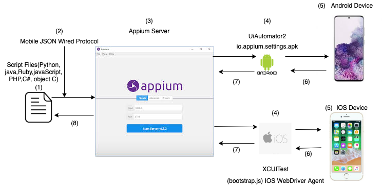

How It All Works Together `v1`


- Appium host **server** that listen to incoming HTTP request(s) that conform to the web driver API specification. API that the server exposes runs in NodeJS web server (*started on the machine before you run the tests or you can host the appium server as part of your test code*)

- To talk to the server we need a **client library** that understands the web driver protocol and translate this into HTTP client library calls. Appium provide several client libraries for many **popular programming languages**. *You can also write your tests in your **favorite test framework** (JUnit for java developers, NUnit/MSTest for c# developers, Jasmine for JS developers...)*

- Every call that API server receives needs to be translated into command(s) that drives UI of the application you started. Every call needs to be translated into a call on a **physical device**, an **emulator** or **simulator** depending on platform you want to test. For this appium server has **several drivers** (for many platforms) you can install. Out of the box, there are Android and iOS drivers, but you can download drivers for desktop and MAC.

Appium is a tool for automating apps. It has two components: the Appium **server**, which does the actual automating, and a set of Appium **clients**, one for every popular programming language. You write tests in your favorite language by importing the Appium client for that language and using its API to define a set of test steps. When you run the script, those steps are sent one-by-one to a running Appium server, which interprets them, performs the automation, and sends back a result if appropriate. `b02`

...

## Client/Server Architecture...

**Client/Server Architecture**: Appium is at its heart a webserver that exposes a REST API. It receives connections from a client, listens for commands, executes those commands on a mobile device, and responds with an HTTP response representing the result of the command execution. `a2`

**Appium Server**: Appium is a server written in Node.js. `a2`

**Appium Clients**: There are client libraries (in Java, Ruby, Python, PHP, JavaScript, and C#) which support Appium's extensions to the WebDriver protocol. `a2`

Support for the automation of a particular platform is provided by an Appium "**driver**". There are a number of such drivers that give you access to different kinds of automation technologies.  For example, to automate Android applications using one of our Android drivers, you'll need the Android SDK configured on your system. `a2`

- The [Espresso Driver](http://appium.io/docs/en/drivers/android-espresso/index.html) (for Android apps)
- The [UiAutomator2 Driver](http://appium.io/docs/en/drivers/android-uiautomator2/index.html) (for Android apps)

...

### Appium server [+ Desktop + Inspector]...

Appium is **just an HTTP server**. It sits and waits for connections from a client, which then instructs Appium what kind of session to start and what kind of automation behaviors to enact once a session is started. This means that you never use Appium just by itself. You always have to use it with a client library of some kind. Luckily, Appium speaks the same protocol as [Selenium](http://www.seleniumhq.org/), called the **WebDriver Protocol**. Appium can do things that Selenium can't, though, just like mobile devices can do things that web browsers can't. For that reason, we have a set of Appium clients in a variety of programming languages, that extend the regular old Selenium clients with additional functionality. `a2`

Appium can be installed in one of two ways: via [NPM](https://npmjs.com/) or by downloading [Appium Desktop](https://github.com/appium/appium-desktop), which is a graphical, desktop-based way to launch the Appium server. `a2`

- **Installation via NPM**: If you want to run Appium via an `npm install`, you will need [Node.js and NPM](http://nodejs.org/) . The actual installation is as simple as: `npm install -g appium`
- **Desktop App**: Simply download the latest version of Appium Desktop from the [releases page](https://github.com/appium/appium-desktop/releases). OR: Go to http://appium.io/downloads.html and click the “**Appium-Desktop for OSX, Windows, and Linux**” link.

#### Appium Desktop...

Before you can test your app, you have to know how it’s put together! You don’t need to know the nitty-gritty of the app code, but **you do need to know what the UI elements are** that your test will operate on. The recommended method of exploring the element hierarchy of our app, and figuring out how to find specific elements for use in testing involves the visual inspector bundled with **Appium Desktop**. Load up Appium Desktop if you haven’t already.`b02`


Once it launches, simply click the big “**Start Server**” button to get Appium itself up and running. If you installed Appium via npm, and would prefer to use the command-line Appium server, you can also start it as you normally would (running `appium`).`b02`


#### Appium Inspector...

Much like Selenium IDE, Appium too provides a **record and playback** tool called **Inspector**. Appium Inspector makes *finding locators* an easy task. You just need to click on your app’s UI element and Inspector will load all of its available attributes in side panel. The only gripe about this tool is its limited platform support. It is **Mac** and **Windows** only at the moment. So, you will not be able to use it on Linux platform???. `a3`


...

### Appium Clients...

**Appium Clients**: There are **client libraries** (in Java, Ruby, Python, PHP, JavaScript, and C#) which support Appium's extensions to the WebDriver protocol. `a2`

One of the great things about Appium is that you can write Appium scripts in any language. Because Appium is built around a client-server architecture, clients can be written in any programming language. These ***clients are simply*** fancy HTTP clients, which encapsulate HTTP calls to the Appium server inside nice user-facing methods (usually in an object-oriented fashion). `b02`

⚠️ The Appium Java client is not a standalone library: it is actually a wrapper around the standard Selenium Java client. So if you’re already familiar with the Selenium client, you’ll find it easy to understand the Appium version. `b02`

...

### Session...

Automation is always performed in the **context of a session**. Clients initiate a session with a server in ways specific to each library, but they all end up sending a `POST /session` request to the server, with a JSON object called the 'desired capabilities' object. At this point the server will start up the automation session and respond with a session ID which is used for sending further commands. `a2`

### Desired capabilities...

> Desired capabilities are used to initiate, customize and configure a browser session - a set of **key-value pairs** (`settings`) to tell the Appium server what kind of automation session is required. They tell the Appium drivers all kinds of important things about how you want your test to work. 
> 
> There are many, many Capabilities that Appium supports. Capabilities also differ by driver, though there are a standard set that most drivers pay attention to. `a2`
> 
> Taxonomy of capabilities for different **platform** and **drivers** is:
> 
> - **General** capabilities
> - **Android** only capabilities (*further divided into driver specific like UIAutomator1, UIAutomator2, Espresso available capabilities*)
> - **iOS** only capabilities

The client sends JSON ‘desired capabilities’ object to server to initiate a session. You must be wondering as to what is ‘desired capabilities’. Well, to put it simply, they are a set of **key-value pairs** to tell the Appium server what kind of automation session is required. For example, setting `platformVersion` capability to 4.4 tells Appium to initiate an Android 4.4 session. Similarly, `platformName` capability tells Appium to start iOS, Android or Windows platform session. `a3`

In WebDriver-land, **parameters used to start a session** are known as `desired capabilities`. `b02`

Desired Capabilities can be **scripted** in the WebDriver test or **set** within the Appium Server GUI (via an Inspector Session). `a2`

## Appium Drivers...

You probably want to use Appium to automate something specific, like an **iOS** or **Android** application. `a2`

Support for the automation of a particular platform is provided by an Appium "**driver**". There are a number of such drivers that give you access to different kinds of automation technologies.  For example, to automate Android applications using one of our Android drivers, you'll need the Android SDK configured on your system. `a2`

- The [Espresso Driver](http://appium.io/docs/en/drivers/android-espresso/index.html) (for Android apps)
- The [UiAutomator2 Driver](http://appium.io/docs/en/drivers/android-uiautomator2/index.html) (for Android apps)

There are a **number of such drivers** that give you access to different kinds of automation technologies, and each come with their own particular setup requirements. Most of these requirements are the same requirements as for app development on a specific platform. List of available (most popular) drivers: `a2`

- The [XCUITest Driver](https://appium.io/docs/en/drivers/ios-xcuitest/index.html) (for iOS and tvOS apps)
- The [Espresso Driver](https://appium.io/docs/en/drivers/android-espresso/index.html) (for Android apps)
- The [UiAutomator2 Driver](https://appium.io/docs/en/drivers/android-uiautomator2/index.html) (for Android apps)
- The [Windows Driver](https://appium.io/docs/en/drivers/windows/index.html) (for Windows Desktop apps)
- The [Mac Driver](https://appium.io/docs/en/drivers/mac/index.html) (for Mac Desktop apps)

Each automation technology provided by Appium is wrapped up into a bit of code called an **Appium driver**. Each driver knows how to translate the WebDriver protocol to that particular technology. `b02`

You’re using Appium in conjunction with one or more drivers. Even one platform (like Android), might have **multiple** supported Appium drivers, which target different fundamental automation technologies (UIAutomator2, Espresso). `b02`

...

## Appium Simple Test Project Setup...

Steps to create Appium Simple project:

1. Create new (gradle/maven) project and fill artifacts info.

2. Add `java-client` dependencies to `pom` or `build.gradle` file
   
   ```properties
   // --- pom file ---
   <!-- https://mvnrepository.com/artifact/io.appium/java-client -->
   <dependency>
       <groupId>io.appium</groupId>
       <artifactId>java-client</artifactId>
       <version>8.0.0</version>
   </dependency>
   ```
   
   or
   
   ```properties
   // --- build.gradle ---
   implementation 'io.appium:java-client:8.0.0'
   ```

3. Add dependencies to **unit testing framework** (if not already done by wizard)
   
   ```properties
   // --- pom file ---
   <dependency>
       <groupId>org.junit.jupiter</groupId>
       <artifactId>junit-jupiter-engine</artifactId>
       <version>5.8.0</version>
       <scope>test</scope>
   </dependency>
   ```
   
   or
   
   ```properties
   // --- build.gradle ---
   testImplementation 'org.junit.jupiter:junit-jupiter-engine:5.8.0'
   ```

4. Creating new driver session (with `DesiredCapabilities`) using [Emulator for Android, Simulator for iOS, Real Device - Android/iOS]
   
   1. **Emulator for Android**
      - Start Appium SERVER
      - Set `DesiredCapabilities` required values (*minumum is*: `platformName`, `app`)! 
        - `app` contains path to your **apk** file. ⚠️ Use `System.properties("user.dir")` and `File.separator` to create path variable in platform agnostic way!
        - `platformName` is `Android`
        - As a good practice, you can provide other capabilities as `platformVersion`, `deviceName`, `automationName`! You can get list of connected (virtual or real) devices with `emulator -list-avds` in terminal/CLI
      - Put desired `*.apk` file into `src/main/resources/` folder
      - Create appium driver object (like `AppiumDriver driver = new AndroidDriver(url, capabilities);`) where:
        - `DesiredCapabilities capabilities`: contains mandatory settings
        - `URL url`: contains full path to the apk including file name ifself
        - `AppiumDriver` is one of
          - `AppiumDriver` for both Android and iOS
          - `AndroidDriver` for Android devices only
          - `IOSDriver` for iOS devices only
      - Launch Virtual Device in Emulator or connect Real Device
      - **RUN** the test(s)/session
   2. todo - Real Device
   3. todo - Simulator for iOS

Example test class:

```java
public class SimpleTest {
    private static final String APP = "/path-to-apk/YourFileName.apk";
    private static final String APPIUM = "http://localhost:4723/wd/hub";

    private AndroidDriver driver;

    @Before()
    public void setUp() throws MalformedURLException {
        DesiredCapabilities caps = new DesiredCapabilities();
        caps.setCapability("platformName", "Android");
        caps.setCapability("app", APP);
        driver = new AndroidDriver(new URL(APPIUM), caps);
    }

    @After()
    public void tearDown() {
        if (driver != null) {
            driver.quit();
        }
    }

    @Test
    public void test() {
        WebDriverWait wait = new WebDriverWait(driver, 10);
        WebElement elem = wait.until(
            ExpectedConditions.presenceOfElementLocated(
                MobileBy.AccessibilityId("some-id")));
        elem.click();
    }
}
```

<br/>

## Working with Elements...

⚠️ *For detailed information on how to spy for elements see* [Finding elements for script](#)

> Locator's strategies for finding elements on mobile devices:
> 
> - id
> - Name
> - ClassName
> - LinkText
> - XPath
> - cssSelector
> - AccessibilityId
> - AndroidUIAutomator/IosUIAutomation

### Finding elements by ID (web-based)

**Locates elements whose ID attribute matches the search value**. Using IDs is the **easiest** and the **safest way** to locate an element in a page. If a web page is W3C HTML conformed, the IDs should be **unique** and identified in web controls. 

Finding an element by ID is used to locate **only one element** (IDs should be **unique** ) in the mobile app. Process of finding element by `ID`:

1. Open the Chrome browser on your (MOBILE) device and navigate to the desired URL

2. Navigate to  `chrome://inspect/#devices` page in your chrome browser, page will display all the **connected devices** along with the **open tabs** and web views.
   
   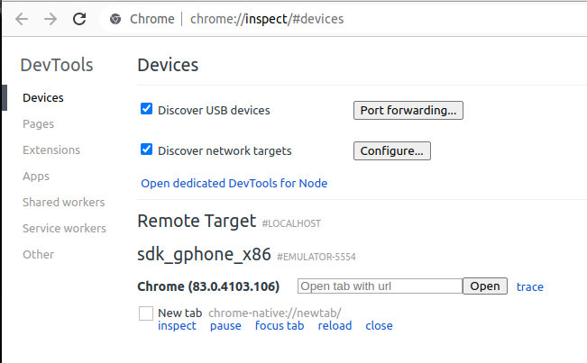

3. Find your page in the list of available pages and click on `inspect` button bellow the page.
   
   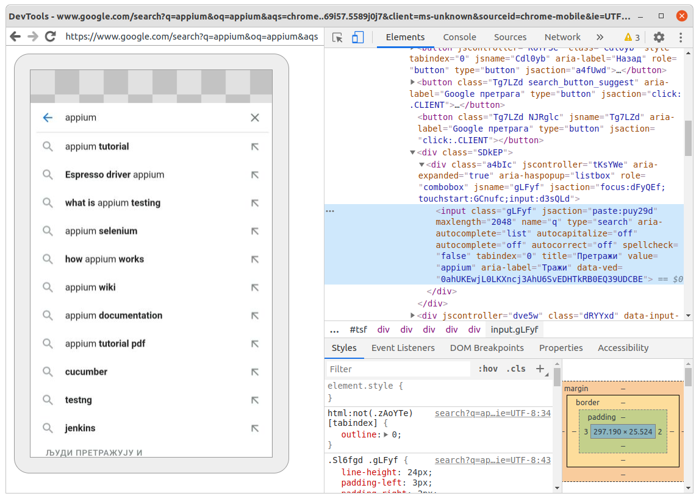

4. Find `ID` attribute value for desired control.

5. Use value in your code

```java
// Find element by ID
WebElement elemByID = driver.findElement(By.id("elem-id-here"));

//WebElement elemByID = driver.findElementById("elem-id-here");
//AndroidElement elemByID = (AndroidElement) driver.findElementById("elem-id-here");
```

<br/>

### Finding elements by resource-id

⚠️ Note that `ID` attribute is used for **web** application, and for **native** application, we should look for `resource-id` attribute (*if exists/assigned to the element*)!

---

Process of finding the element by resource id using **Appium Inspector** is:

1. Start Appium Server and click on `Start Inspector Session`

2. Fill Desired capabilities with appropriate values
   
   ```json
   {
     "platformName": "Android",  
     "udid": "emulator-5554",
     "app": "/path-to-app/appNameHere.apk"
   }
   ```

3. Click on `Start Session` button. Wait for session to initialize (*run or install `apk` if not already installed*).

4. Find element (go to the element with pointer) and click on it. Properties for the selected element will be shown on the right side of the tool. Find `resource-id` property.
   
   

5. Use property value in your code:

```java
AndroidElement elemByID = (AndroidElement) driver.findElementById("elem-id-here");
```

---

Process of finding the element by resource id using **UIAutomatorviewer** is:

1. Open application on emulator/simulator/real device?
2. Open `UIAutomatorviewer`
3. Click on `Device Screenshot` button to get current screen.
4. Find `ID/resource-id` for required element:

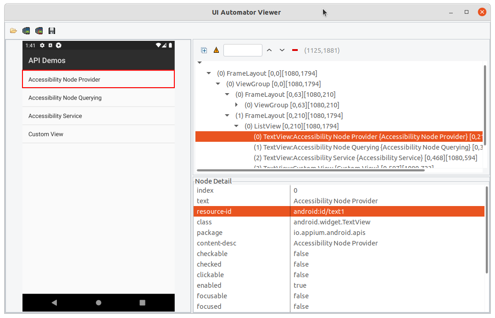

<br/>

### Finding elements by Name ...

**Locates elements whose tag name matches the search value** . This is the way to find an element by their name (*if name attribute assigned to the element*). The process of locating elements by name is the same as for ID, except we're using `name` attributes value instead. 

1. Open the Chrome browser on your (MOBILE) device and navigate to the desired URL
2. Navigate to  `chrome://inspect/#devices` page in your chrome browser...
3. Find your page in the list of available pages and click on `inspect` button...
4. Find `name` attribute value for desired control.
5. Use value in your code

```java
WebElement elemByName = driver.findElement(By.name("element-name"));
```

⚠️ For native application we'll use `text` property as a **name** for the element!?

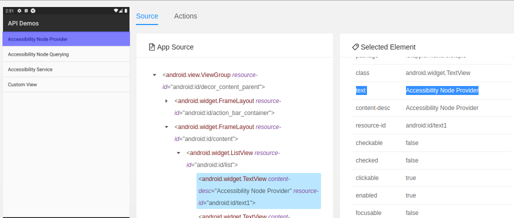

<br/>

### Finding elements by LinkText (web-based)...

**Locates anchor elements whose visible text matches the search value**. This method is useful when you want to locate the element that has a **hyperlink**. The same process as for [ID, name, class] is used here as well. Some practical usage example:

```java
WebElement elemByName = findElement(By.linkText("anchor-link-text-here"));
```

<br/>

### Finding elements by cssSelector (web-based)

**Locates elements matching a CSS selector**. In CSS, a **(CSS) Selector** is a pattern that matches/selects some HTML element or elements on the page you want to style. Put simply, <mark>the selector tells the browser what to style</mark>. 

`cssSelector` strictly operates on HTML. The same process as for [ID, name] is used here as well. Some practical usage example:

```java
WebElement elemByCss = driver
     .findElement(By.cssSelector("input[name=txtUsername]")).click();
```

<br/>

### Finding elements by ClassName (web-based)...

**Locates elements whose class name contains the search value** (<mark>compound class names are not permitted</mark>).  We can find an element using the `className` locator as well. For this purpose, we'll use `class` attribute of the element. Class name as an attribute is present in HTML and native applications, hence this attribute can be used for all types of mobile applications. Some practical usage example:

```java
WebElement elemByClassName = driver.findElement(By.className("element-class-name"));
```

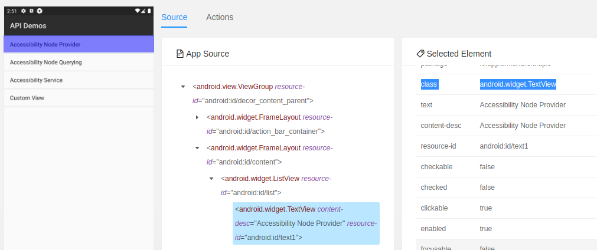

<br/>

### Finding elements by XPath...

**Locates elements matching an XPath expression**.  XPath strategy should be used whenever there's no other option of locating element. As a general approach, you need to place android class name instead tag/element name in XPath expression for native applications:

```shell
General XPath expression    >>   //element[@attr='val'] 
XPath expression 4 android  >>   //android.class.name[@attr='val']
Practical example           >>   //android.widget.TextView[@text = 'Echo Box']
```

Some practical usage example:

```java
WebElement lbl = driver.findElementByXPath("//android.widget.TextView[@content-desc'Accessibility Node Provider']");
```

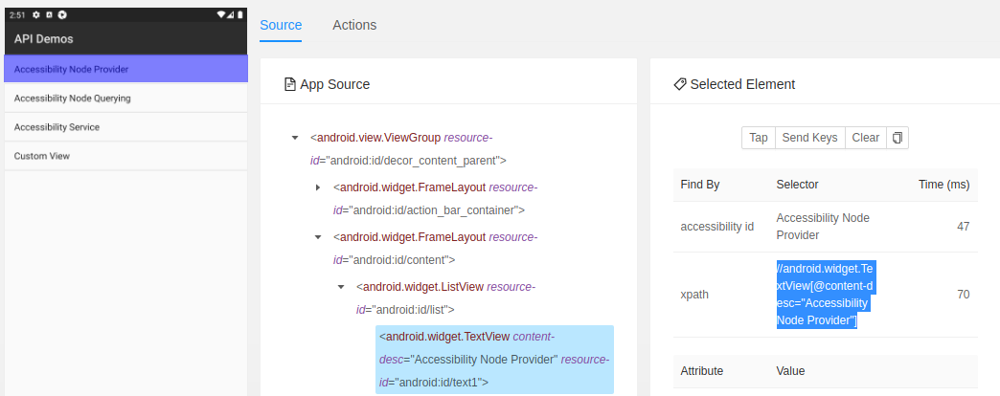

<br/>

### Finding elements by AccessibilityId...

The Appium developers wanted to give us more options to locate an element, so they created `AccessibilityId`. It locates the element, same as ID and name. `b01`

⚠️ `AccessibilityId` is same as `content-desc` attribute founded by inspector?

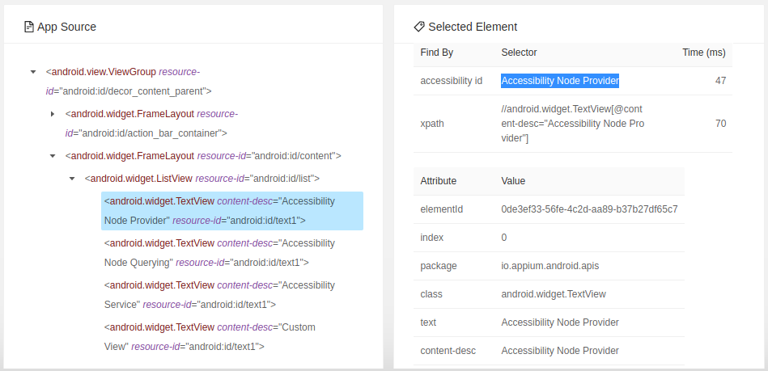

<br/>

### Finding elements by AndroidUIAutomator/IosUIAutomation...

`AndroidUIAutomator` is a very powerful locator to find an element. It uses the Android
UIAutomator library to find an element. The method signature looks like this: `b01`

```java
findElement(By.AndroidUIAutomator(String UIAuto));
```

We need to pass the `UIAuto` of an element that we want to interact with. For example, if we want to use `resource-id` attribute value of an element, the code should look like:

```java
// using `resource-id` attribute
WebElement accEleme1 = driver
      .findElementByAndroidUIAutomator("resourceId(\"android:id/text1");  
```

<br/>

## Advanced Interactions...

> Mobile gestures [Long press, Scroll and swipe, Drag and drop, Pinch and zoom]
> 
> Handling alerts
> 
> Handling spinners (drop-downs)
> 
> Handling the switch button
> 
> Handling the slide SeekBar
> 
> Capturing screenshots

### Mobile gestures...

#### Long press

**Long press** is a mobile gesture used to get more information about a particular feature. Just like a context-click on the Web, it also enables multi-selection in mobile apps. `b01`

```java
TouchAction tAction = new TouchAction(driver);
tAction.longPress(driver.findElement(By.name("0"))).perform();
```

#### Scrolling

**Scrolling** is the process of moving the visual portions of mobile apps in order to see additional information. On a mobile device, you can use your finger to swipe up or down in order to scroll down
or scroll up the screen. **Swiping** your finger upwards will lead to a scroll down and swiping down will perform a scroll up. `b01`

```java
// Scrolling
driver.scrollTo("name-in-contact-list");
// Swipping
TouchAction tAction = new TouchAction(driver);
tAction.press(300,500).moveTo(600,500).release().perform(); // swipe right
```

#### Drag and drop

A **drag and drop** operation allows you to move objects from one location to another. `b01`

```java
MobileElement calculator=
  (MobileElement)driver.findElementByName("Calculator");
TouchAction act = new TouchAction(driver);
act.press(calculator).perform();
act.moveTo(driver.findElement(By.name("App info"))).release().perform();
```

#### The pinch and zoom

The **pinch and zoom** gesture is similar to the drag gesture, but it starts when the second finger is pressed on the mobile screen. Appium supports multi-touch gestures using the `MultiTouchAction` class. You can add multiple actions simultaneously using the `MultiTouchAction` class.

```java
MultiTouchAction multiTouch = new MultiTouchAction(driver);
TouchAction tAction0 = new TouchAction(driver);
TouchAction tAction1 = new TouchAction(driver);
tAction0.press(scrWidth/2,scrHeight/2)
    .waitAction(1000).moveTo(0,60).release();
tAction1.press(scrWidth/2,scrHeight/2+40)
    .waitAction(1000).moveTo(0,80).release();
multiTouch.add(tAction0).add(tAction1);
multiTouch.perform();
```

### Alerts...

An **alert** is a small window that <mark>requires a user action</mark> to make a decision or enter some extra information. We can’t interact with the original window while the alert dialog is present; to work with the original window, we need to close the alert dialog. `b01`

⚠️❓ On iOS, an alert dialog box can be handled by the Selenium Alert API but on Android OS, alert handling is **not yet implemented for native apps**. However, we have an alternative to handle the alert. We can find the buttons that are present on the alert box using locator strategy. `b01`

```java
WebElement showAlert = driver.findElement(By.name("Show Alert"));
showAlert.click();    // it will open the Alert box
WebElement yes = driver.findElement(By.name("Yes"));
yes.click();        // Click on Yes button
```

### Spinners...

**Spinners** allow you to select a value from the dropdown list and also show the currently selected value. `b01`

```java
WebElement spinner = driver.findElement(By.id("spinner-id-here"));
spinner.click();
driver.scrollToExact("some-option");
WebElement someOption = driver.findElement(By.name("some-option"));
someOption.click();
```

### The switch button...

Switches are used to change the settings options; this can be easily handled in Appium. A switch can be turned ON/OFF by just clicking on it. `b01`

```java
WebElement switchbtn = driver.findElementById("switch-btn-id-here");
switchbtn.click();
```

### The slide SeekBar...

A **SeekBar** is an *extension of the progress bar*, which allows you to set the progress level by sliding it to the left or right using the thumb. `b01`

```java
WebElement slider = driver.findElementById("slider-id-here");
// SeekBar’s start point and end point locations
int xAxisStartPoint = slider.getLocation().getX();
int xAxisEndPoint = xAxisStartPoint + slider.getSize().getWidth();
int yAxis = slider.getLocation().getY();
// Use the touchAction class to slide the SeekBar
TouchAction act=new TouchAction(driver);
act.press(xAxisStartPoint,yAxis).moveTo(xAxisEndPoint-1,yAxis).release().perform();
```

### Capturing screenshots...

Basically, a **screenshot** is captured for reporting purposes, when the test fails. Mosy common approach is to use file to save screenshot but screenshot can be also saved as `Byte` and/or `Base64` data structure. `b01`

```java
WebElement five=driver.findElement(By.name("5"));
File screenShot=driver.getScreenshotAs(OutputType.FILE);
File location=new File("screenshots");
String screenShotName=location.getAbsolutePath()+File.separator+"testCalculator.png";
FileUtils.copyFile(screenShot,new File(screenShotName));
```

<br/>

## Appium Design Patterns intro...

> In Nutshell:
> 
> <mark>The **Page Object Design Pattern** provides clean separation between test code and page specific code such as locators (or their use if you’re using a UI map) and layout.  A page object is an object-oriented class that serves as an **interface to a page** of your AUT. The tests then **use the methods** (*public interface*) of this page object class whenever they need to interact with that page of the UI. </mark>
> 
> ⚠️ In order to support the Page Object pattern, WebDriver's support library contains a factory class. **Page Factory** is used to perform an initialization of the elements on the page (object).
> 
> Why design patterns anyway:
> 
> - Avoid code **duplication**
> - Improve code **readability** - tests should be more readable
> - Introduce code **re-usability**
> - **Maintainability** - tests should be easy to maintain
> - **Scalability** - A structure that is easy to scale with the growth of the project
> 
> As a general rule,most of the tests can be broken into three parts (*Unit Testing  **Arrange**, **Act** and **Assert** (AAA) pattern*): `w1`,`w2`
> 
> - <big>Pre-condition</big> (**Arrange**): Perform the setup and initialization required for the test.
> - <big>Action and verification</big> (**Act**):  Take action(s) required for the test - invokes the method(s) under test. In E2E testing, invokes specific steps/actions (method(s) in page object).
> - <big>Post-condition</big> (**Assert**): Verify the outcome(s) of the test - verifies that the action of the method under test behaves as expected. In E2E testing, verifies that functionality behaves as expected.
> 
> `Given-When-Then` and `Arrange-Act-Assert` are two similar ways of structuring your test cases to make them easier to understand at a glance. `w3`
> 
> **Given-When-Then** originates from Behaviour Driven Development. Thinking Given-When-Then helps to think in terms of behavior rather than internal state. `w3`
> 
> ```gherkin
> Given a state or situation (which you set up in the test)
> When I do something or an event happens n
> Then I expect an outcome (assert) or interaction between collaborators (mock verify)
> ```
> 
> **Arrange-Act-Assert** is a similar pattern from the eXtreme Programming community.`w3`
> 
> ```markdown
> Arrange a state or situation (which you set up in the test)
> Act to do something or an event happens n
> Assert the expected an outcome collaborator interaction
> ```
> 
> ---
> 
> ⚠️ Some common sense guidelines & common design principles:
> 
> - **Pragmatism**, thinking instead of **blindly following principles**!
> - **KISS** - keep it simple and stupid. Avoid adding complexity without justification.
> - **Dependency injection** means giving an object its instance variables. That's it. 
> - **The separation of concerns** (SOC) state that each class should do one and only one thing and do it well. (*A **concern** is any piece of interest or focus in a program . Typically, concerns are synonymous with features or behaviors.*)
> - "**You aren't gonna need it**" (YAGNI) is a principle of extreme programming (XP) that states a programmer should not add functionality until deemed necessary. *Don't  over design the systems - sometimes it was innocent, but  many times it was complexity for complexity's sake.*
> - **Don't repeat yourself** – DRY.  A modification of any single element of a system does not require a change in other logically unrelated elements. *Don't **copy and paste** <mark>unchanged</mark> block of code, there should be **one single source** of truth!*

One **common issue** with the test code is that we are **mixing information** about our app (namely which elements can be found with which locators) and information about our test (which test steps constitute the flow we are trying to test). Another issue is that, as soon as we add a second login-related test, we’ll begin duplicating our selector strings. The common solution to these problems is to use something called the **Page Object Model.** A Page Object represents a view (for example our Login view), and ***exposes only high-level actions*** so that test code can deal in user-level behaviors rather mixing in low-level element finding logic. `b02`

In this model, the responsibility of finding elements, waiting for them to appear, or getting data from them lies in the so-called “**page objects**”. Each of these objects are instances of individual classes, one per app view involved in our automation. (Since this technique was pioneered with web page automation, we have the term “page object”; in the mobile world we would more accurately call these classes “**view objects**”). We use annotations like `@FindBy` or `@iOSFindBy` to denote the strategy and the selector finding a certain element. We can also use another annotation, `@WithTimeout`, to express how long we would like to wait for a particular element to appear. Once we have our fields annotated, we have only two more tasks in this
file: first, to write up a constructor which takes an instance of `AppiumDriver` (so that our elements know which driver to use to find themselves), and initializes the `PageFactory` elements in our class. The final task is to expose user-level behaviors in methods on the object (in this case, the only thing we care about) `b02`

```java
public class LoginView {

  @WithTimeout(time = 10, unit = TimeUnit.SECONDS)

  @FindBy(xpath = “//XCUIElementTypeTextField[@name=\”user\”]”)
  private WebElement usernameField;

  @FindBy(xpath = “//XCUIElementTypeSecureTextField[@name=\”pwd\”]”)
  private WebElement passwordField;

  @iOSFindBy(accessibility = “loginBtn”)
  private WebElement loginBtn;

  public LoginView(AppiumDriver driver) {
     PageFactory.initElements(new AppiumFieldDecorator(driver), this);
  }

  public void login(String username, String password) {
    usernameField.sendKeys(username);
    passwordField.sendKeys(password);
    loginBtn.click();
  }
}
```

Notice how the implementation of the login method is clean and easy to read, because ***no selectors and strategies are mixed*** in with the login logic. Instead, the specifics of finding elements is left to the element annotations. Despite the fact that we have some extra imports and setup boilerplate, our test code itself is now much more maintainable and easy to understand. Furthermore, in future tests we now have access to a growing library of *high-level methods that we can reuse*. Finally, if a selector changes for an app element, we have just one place to go to fix it without having to worry about where else it might be in our codebase. `b02`

⚠️ Appium is a **cross-platform automation tool**, which means support for Android in addition to iOS.  The Appium is a cross-platform app, designed to work the same way on both iOS and Android.  What we’d ideally like to see is **complete test code reuse**, such that the **only difference** between our iOS and Android test-cases **is the setup for each**. `b02`

---

**Page Object pattern** is about modeling your app's UI as an object. A Page Object wraps the UI of a page with an app-specific API, which allows us to manipulate page elements. `b04`

⚠️ There are some discussions around as to whether a Page Object **should include assertions or not**. Assertions are the core of test automation, and there has been a good long debate on where assertions belong. Broadly, there are ***two types of approaches*** for handling assertions, and they can be implemented in either of the following:

- Page Object
  - The **advantage** of this approach is to minimize the duplication of assertions in the test suite. 
  - It helps in organizing the messages and following the **Tell, Don't Ask** principle.  Principle recommends that an object can be **issued a command** to perform some operation or logic, rather than to **query its state**.   It suggests that we should tell the object what to do, rather than asking the object for data and then acting on it. ⚠️ <mark>*Bertrand Meyer devised CQS, or **Command Query Separation**: Every method should either be a **command** that performs an action (change objects but do not directly return results), or a **query** that returns data to the caller (provide information about objects but do not change them), but **never both**.*</mark>
- Test script
  - In this case, we will have a Page Object that **implements a getter** for the **element state** we want to have a check on or verify upon. 

...

<br/>

## ...[Covering variety of devices, screen sizes and OS versions]...

todo

## ...Appium project in CI/CD pipeline...

todo

# Resources...

| ID   | Title                                                                | Link                                                                                               |
| ---- | -------------------------------------------------------------------- | -------------------------------------------------------------------------------------------------- |
| `a1` | The Comprehensive Guide for Selenium Mobile Testing                  | https://digital.ai/catalyst-blog/the-comprehensive-guide-for-selenium-mobile-testing               |
| `a2` | Getting Started                                                      | https://appium.io/docs/en/about-appium/getting-started/index.html                                  |
| `a3` | Appium Tutorial for Complete Beginners                               | http://www.testingdiaries.com/appium-tutorial/                                                     |
| `a4` | Appium Tutorial Step by Step Appium Automation                       | https://www.swtestacademy.com/appium-tutorial/                                                     |
|      |                                                                      |                                                                                                    |
|      |                                                                      |                                                                                                    |
| `m1` | Mobile Testing - Quick Guide                                         | https://www.tutorialspoint.com/mobile_testing/mobile_testing_quick_guide.htm                       |
| `m2` | Simulators vs Emulators vs Real Devices \|Mobile Testing Differences | https://katalon.com/resources-center/blog/simulator-emulator-real-device                           |
| `m3` | The Comprehensive Guide for Selenium Mobile Testing                  | https://digital.ai/catalyst-blog/the-comprehensive-guide-for-selenium-mobile-testing               |
| `m4` | Fiddler for Mobile Application Testing                               | https://blog.e-zest.com/fiddler-for-mobile-application-testing                                     |
| `m5` | Testing Mobile: Emulators, Simulators And Remote Debugging           | https://www.smashingmagazine.com/2014/09/testing-mobile-emulators-simulators-remote-debugging/     |
| `m6` | Debug your website on a mobile device                                | https://blog.campvanilla.com/debug-website-on-mobile-device-5c27c8809d39                           |
| `m7` | How to debug mobile app requests and test their APIs                 | https://dragoscampean.medium.com/how-to-debug-mobile-app-requests-and-test-their-apis-c58dcc1d7c7f |
|      |                                                                      |                                                                                                    |
|      |                                                                      |                                                                                                    |
| `v1` | Appium The Big Picture                                               | Pluralsight Appium The Big Picture                                                                 |
|      |                                                                      |                                                                                                    |
| `w1` | Arrange/Act/Assert                                                   | https://java-design-patterns.com/patterns/arrange-act-assert/                                      |
| `w2` | Unit test basics                                                     | https://docs.microsoft.com/en-us/visualstudio/test/unit-test-basics?view=vs-2022                   |
| `w3` | GIVEN-WHEN-THEN OR ARRANGE-ACT-ASSERT                                | https://www.qwan.eu/2021/09/02/tdd-given-when-then.html                                            |
|      |                                                                      |                                                                                                    |

| ID    | Title                              | Author                              |
| ----- | ---------------------------------- | ----------------------------------- |
| `b01` | Appium Essentials                  | Manoj Hans © 2015 Packt Publishing  |
| `b02` | GETTING STARTED WITH APPIUM        | Jonathan Lipps  Java Edition 2018.4 |
| `b03` | Mastering Mobile Test Automation   | Louis&Gupta © 2015 Packt Publishing |
| `b04` | Mobile Test Automation with Appium | Verma © 2017 Packt Publishing       |
|       |                                    |                                     |

...

# Appendices

## Appium installation...

### Appium setup on windows/linux

**STEPS**:

1. Installing pre-requisites 
2. Installing Appium 
3. Installing Android Studio 
4. Validating installation 
5. Creating Android Virtual Device 
6. Connecting to Real Device (by enabling USB debugging) 
7. Create driver session using Appium Desktop

<br/>

#### (1) Installing pre-requisites

---

> Java (version 7 or later)
> 
> Android SDK API ⚠️ will be installed with appium (easy way)

Java SDK + JAVA_HOME steps:
🔸 1.0 Download required version of Java SDK from 

- https://www.oracle.com/java/technologies/downloads/#java8

- https://www.oracle.com/java/technologies/downloads/#java11

- ...

- https://www.oracle.com/java/technologies/downloads/#jdk17-windows

🔸 1.1 Set JAVA_HOME

- `Environment variables|System variables` > New > JAVA_HOME=C:\Program Files\Java\jdk1.8.0_261

- `Environment variables|System variables|Path` > Edit > New = `%JAVA_HOME%\bin` > OK

🔸 1.2  Check for version. Open cmd and type `java --version`

<br/>

#### (2) Installing Appium

> 2.1 Installation via NPM
> 
> OR
> 
> 2.2 Installation via Desktop Application (preffered)

<br/>

🔶 2.0  Check for existing versions of Node and `npm`. Open cmd or powershell and type:

> node -v
> npm -v

🔶 2.1 Installation via NPM

- Install NodeJS (installer exe from `https://nodejs.org/en/download/`). Downloda and Run installer and include `npm` in installation! 

- Open cmd and run `npm install -g appium`

🔸 2.2 Installation via Desktop Application

- Download Appium Desktop from `https://github.com/appium/appium-desktop`    which is bundled with NodeJS so you don't have to install NodeJS separately

⚠️ **NOTE**: an inspector UI used to be included with Appium Desktop. It is now its own separate app: Appium Inspector. Go to `https://github.com/appium/appium-inspector/releases` to download  Appium Inspector.

⚠️ If you plan to integrate automation with CI/CD pipeline, it's better to use cmd version.

<br/>

#### (3) Installing Android Studio

🔶 3.0 Download the latest version of [Android Studio ](https://developer.android.com/studio)

🔶 3.1 Installing Android Studio

- Follow the setup wizard in Android Studio and install any SDK packages that it recommends.

- `Appearance & Behaviour > System Settings > Android SDK` open `SDK Tools` tab and select/enable for installing  (if not already installed):
  
  - Android SDK command-line Tools
  
  - Android Emulator
  
  - Android SDK Platform-Tools

- ⚠️ Android SDK default location: `%USERPROFILE%\AppData\Local\Android\SDK`

🔶 3.2 Set `ANDROID_HOME` and paths

- `Environment variables|System variables` > New > ANDROID_HOME = C:\Users\PC\AppData\Local\Android\Sdk > OK

- `Environment variables|System variables` > Edit `Path` and add the following entries:
  
  - `%ANDROID_HOME%\platform-tools`
  
  - `%ANDROID_HOME%\tools`
  
  - `%ANDROID_HOME%\tools\bin`

🔶 3.3 Open `cmd` and type the following commands (to check that everything is working)

> sdkmanager --version
> 
> sdkmanager --list
> 
> adb

<br/>

#### (4) Validating installation

🔶 4.1 Open `cmd` or powershell and type

> npm install -g appium-doctor

Verify that tool is installed

> appium-doctor --version

🔶 4.2 Check Android setup (⚠️ you can ignore warning messages)

> appium-doctor --android 

<br/>

#### (5) Creating Android Virtual Device

⚠️ ***Make sure that you have enough space on disk (depending on Android version >10GB on disk plus enough RAM memory to start device)***

🔶 5.1 Launch Android Studio > Projects (tab) > (from ...menu) Virtual Device Manager

🔶 5.2 Create Device

- Phone
- Pixel 2 (for example)
- Select a system image: Android X.Y (of your choice, for example: Target = Android 7.0)
- Verify Configuration (Advanced settings if required)
- Wait for download to finish

🔶 5.3 Launch this AVD in the emulator (if you run it for the first time, it will take some time)

<br/>

#### (6) Connecting to Real Device (by enabling USB debugging)

Steps on real device differ based on the phone, but in general:

🔶 6.1 Settings > System > About Phone > Tap/click on Build Number 7-8 time (6+ times)

🔶 6.2 Settings > Developer Option > Enable USB Debugging

🔶 6.3 Connect your phone to USB port and when permission dialog pop ups, click allow to recognize device on your computer

🔶 6.4 Open cmd prompt to check if device is recognized by issuing command:

> adb devices

Output should be something like:

> List of devices attached
> W6H4C16201003369        device      <<-- REAL device
> emulator-5554             device    <<-- Android Virtual Device in emulator    

⚠️ In case of problems, you can install USB drivers from the following locations:

- Google: https://developer.android.com/studio/run/win-usb {The Google USB Driver is required for Windows if you want to perform adb debugging with Google devices.}
- OEM:    https://developer.android.com/studio/run/oem-usb {This page provides links to the web sites for several original equipment manufacturers (OEMs), where you can download the appropriate USB driver for your device.}

**OPTIONAL**

- Download Vysor app (vysor.io) mirror android device on win machine???

<br/>

#### (7) Create driver session using Appium Desktop

🔶 7.1 Launch Appium Desktop, Leave default values for host (0.0.0.0) and port (4723) ! 

🔶 7.2 Make sure that you have edited configuration properly. Click on `Edit configuration` and enter proper values for environment variables (ANDROID_HOME & JAVA_HOME). If this is already done (1.1 and 3.2)

🔶 7.3 Click on `Start Server` button to launch appium server

🔶 7.4  Launch `Appium Inspector` by clicking on search icon `Start Inspector Session`

🔶 7.5 Enter the following desired capabilities:

- platformName
- deviceName
- automationName
- udid
- app

Example:

```json
{
  "platformName": "Android",
  "deviceName": "Pixel_API_24",
  "automationName": "UiAutomator2",
  "udid": "emulator-5554",
  "app": "C:\\tmp\\TheApp-v1.2.1.apk"
}
```

where:

- **platformName**:   Name of the platform, in this case `Android`
- **deviceName**:   Name of the device (emulator or real). Just enter name of emulator device or name of tour real device
- **automationName**:    `UiAutomator2` driver for Android will be used
- **udid**:   ID of your device. Can be founded by `adb devices` command (6.4)    
- **app**:  (Complete)file path to your application, including file name    

🔶 7.6 Click on `Start Session` and wait for session to be created and connected. Appium will install aplication (if not already installed) on emulator/real device and start application.

<br/>

## Appium limitations...

Appium limitations: `a3`

- Inability to properly synchronize with AUT.
  
  > Probably the single most limiting factor for Appium is its inability to properly synchronize with AUT. When our automation tests are running, we wait for some action to complete. It can be waiting for some element to load or waiting for an element to get ready for further actions. Appium does not handle this delay intelligently. Sure, you can put [wait command](http://www.testingdiaries.com/selenium-webdriver-wait/) to overcome this. But it is not efficient solution...

- Scalability
  
  > Due to technical limitation of Apple’s Instruments framework, you can ***only execute one test at a time per Mac***. This is a big limitation as buying multiple Macs can prove costly.

- Mac system to run iOS tests.
  
  > You will need Mac system to run iOS tests. So you ***can’t automate iOS apps on Windows or Linux*** systems. It’s because Appium requires Xcode for iOS automation which is Mac-only at the moment.

Appium limitations: `a15`

- Microsoft Windows does not support running Appium Inspector ???.
- Appium does not allow the testing for Android versions lower than 4.2.

<br/>

## Finding elements for script

> 1. By using UIAutomatorviewer
> 2. By using Appium Inspector from Appium Desktop
> 3. Chrome ADB plugin

### By using UIAutomatorviewer

🔶1.1 Start `UIAutomatorviewer`! 

- Default location in Windows is `C:\Users\USER_PROFILE\AppData\Local\Android\Sdk\tools\bin\uiautomatorviewer.bat`

- Location in Ubuntu: `/home/USER/Android/Sdk/tools/bin`! Then you need to type `./uiautomatorviewer`

⚠️ In case that you get an error `...Error: Could not create the Java Virtual Machine...`, you need to downgrade to Java 8 SDK. Install Java 8 JDK or, in case that you have multiple SDKs installed selet version 8 by issuing command: `sudo update-alternatives --config java` and selecting (enter right number) for your version:

```shell
XXX:~/Android/Sdk/tools/bin$ sudo update-alternatives --config java
[sudo] password for USER_NAME: 
There are 2 choices for the alternative java (providing /usr/bin/java).

  Selection    Path                                            Priority   Status
------------------------------------------------------------
* 0            /usr/lib/jvm/java-11-openjdk-amd64/bin/java      1111      auto mode
  1            /usr/lib/jvm/java-11-openjdk-amd64/bin/java      1111      manual mode
  2            /usr/lib/jvm/java-8-openjdk-amd64/jre/bin/java   1081      manual mode
```

🔶1.2 Open the Android emulator or real device (For a real device, we need to enable USB debugging).

🔶1.3 Open desired application

🔶1.4 Now, Click on `Device Screenshot` button to get current screen. On the right side of UIAutomatorviewer you'll see elements founded on the page/app.


<br/>

### By using Appium Inspector from Appium Desktop

🔶2.1 Launch Appium Desktop & Click on `Start Server` button to launch appium server

🔶2.2 Launch `Appium Inspector`

🔶2.3 Enter the following desired capabilities:

- platformName
- deviceName
- automationName
- udid
- app

where:

- **platformName**: Name of the platform, in this case `Android`
- **deviceName**: Name of the device (emulator or real). Just enter name of emulator device or name of tour real device
- **automationName**: `UiAutomator2` driver for Android will be used
- **udid**: ID of your device. Can be founded by `adb devices` command (6.4)
- **app**: (Complete)file path to your application, including file name

The most important and **required** key-value pairs are:

```json
{
  "platformName": "Android",  
  "udid": "emulator-5554",
  "app": "/path-to-app/appNameHere.apk"
}
```

🔶 2.4 Click on `Start Session` and wait for session to be created and connected. Appium will run/(install if not already installed) aplication on emulator/real device. 

🔶 2.5 Find desired element(s)

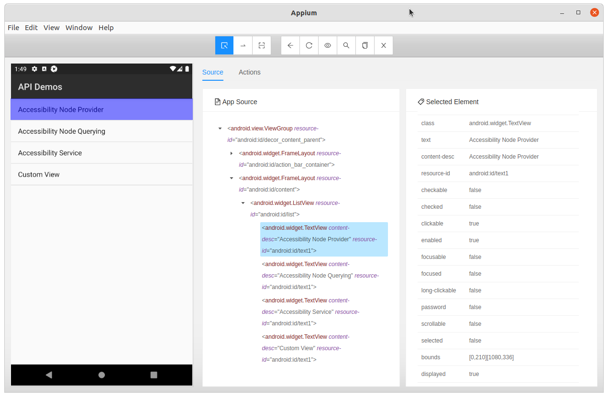

You can also further inspect element by right click on element (or inspector tool anywhere) and select `inspect` option to open **Developer Tools**:

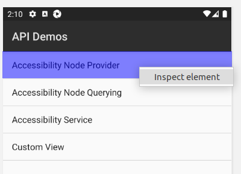

Developer Tools will be shown in Inspector:

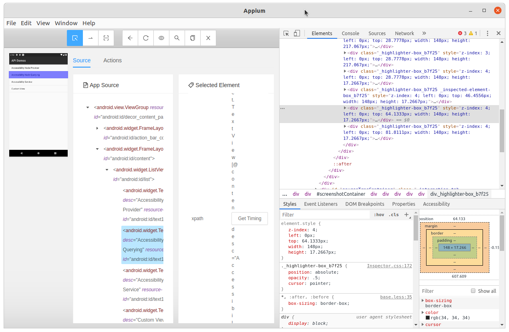

<br/>

### Chrome ADB plugin   - Web application Only

🔶 3.0 Connect your phone to computer and make sure that the `USB debugging` option is checked or, start emulator/simulator (Android Virtual Device image with Device Manager ...)

🔶 3.1 Install `Chrome ADB plugin` in your desktop chrome browser

🔶 3.2 Open the Chrome browser on your (MOBILE) device and navigate to the desired URL

🔶 3.3 Once you set up your device for debugging, then the `chrome://inspect/#devices` page will display all the connected devices along with the open tabs and web views.


🔶3.4 Find your page in the list of available pages. Now, click on the `inspect` link to open the developer tools; Now we can easily inspect elements with Chrome DevTools.


<br/>

## Case study Java+Android...

### Step 1: Pre-requisites

First of all, we need to **install/setup** all the required components! See [Appium installation](#) for more details!

- **Appium** (*HTTP server installed with NodeJS with `nmp` or included with Appium Desktop*) up and running

- **Appium Desktop (+ Appium Inspector)** graphical front-end for Appium for finding elements. 

- Java SDK (plus `JAVA_HOME` variable settings) client library

- Android SDK (Installs with **Android Studio**) (plus `ANDROID_HOME` variable settings) as a Appium driver! ⚠️ Android SDK default location: `%USERPROFILE%\AppData\Local\Android\SDK`

- IDE (like `Intellij IDEA`) + Unit testing framework (like `TestNG`) + build tool (like `Gradle`)

- ❓ `Android Virtual Device` (AVD) running in Android Studio or `Real Device` connected to your computer via USB port with “USB debugging” enabled

...

### Step 2: Project structure/organization

Elements of the solution to be considered:

- src/main/java/com.domain/
  - **pages** [<mark>mandatory</mark>]: Page objects for UI functionalities
  - **configuration** [<mark>mandatory</mark>]: Configuration elements tat handles external property files with various configuration information (urls, capabilities, timeouts...), logging mechanism...
  - **utilities**/helpers [optional]: Common utilities and helper libraries
  - **model** aka object model [optional] For modeling complex screen objects
- src/test/resources
  - **app** [<mark>mandatory</mark>]: Application builds `apk`, `ipa`
  - **data** [optional]: Used for data-driven testing - mostly used to cover alternative, exceptional and edge cases (*preferred format is* `JSON`)
  - **strings** [optional]: Static text used for testing purposes (locators, verification...]

General **project structure** (maven project template)

```markup
  /path/to/project
    ├── build.gradle
    ├── gradle
    ├── gradlew
    ├── gradle.bat
    ├──settings.gradle
    └──src
        ├── main
        │    ├── java
        │     │      ├── configuration    
        │     │      ├── model    
        │     │      ├── pages    
        │     │      └── utilities    
        │    └── resources
        └── test
             ├── java
             │    ├── `TestBase.java`
             │    ├── Feature1-tests
             │    ├── ...
             │    └── FeatureN-tests
             └── resources
                  ├── app
                  │    └── TheApplication-vX.Y.Z.apk
                  └── data  
```

⚠️ For mobile testing, unlike web testing, session initialization occurs in ??? [beforeTest, beforeClass]

<br/>

### Step 3: Project initialization...

We’re going to be working on a Java project, starting from scratch.

1. Initialize a new Java project using Gradle as the build and dependency management tool.
   
   - Open *IntelliJ IDEA Community Edition*: **File >> New >> Project**
   
   - From left panel select `Gradle` and from right panel check the `Java`
   
   - From top of Project SDK select java version
   
   - From **New Project** panel
     
     - Enter **Name**: `<PROJECT_NAME>`
     - Enter **Location**: `<Your Project Location>`
     - Artifact Coordinates:
       - **GroupId**: `com.<ORG_NAME>`
       - **ArtifactId**: `<PROJECT_NAME>`
       - **Version**: `1.0-SNAPSHOT`
   
   - Click on **Finish**

2. Put the `zip` and/or `apk` application file into `/src/test/resources` folder.

3. Next, we need to set up our project dependencies. Open up build.gradle and make sure the dependencies section looks like
   
   ```properties
   dependencies {
     testImplementation 'org.testng:testng:7.5'
     implementation group: 'io.appium', name: 'java-client', version: '8.0.0'
   }
   ```

### Step 4: Exploring application for locators

Before you can test your app, you have to know how it’s put together! Recommended method of exploring the element hierarchy involves the **visual inspector** bundled with `Appium Desktop` - or you can use `UIAutomatorviewer` which is included in Android SDK.

🔶 By `UIAutomatorviewer`

(1) Run **UIAutomatorviewer**

- Windows: Go to `C:\Users\USER_PROFILE\AppData\Local\Android\Sdk\tools\bin` and run **uiautomatorviewer.bat**
- Linux: Go to `/home/USER/Android/Sdk/tools/bin` and type `./uiautomatorviewer`

(2) Start emulator/simulator or connect real device. 

- Windows: Open CMD and type `adb devices` to get list of available/connected devices
- Linux: Open terminal/CLI and type `emulator -list-avds`

(3) Open app on your device, go to screen you want to automate and click on `Device Screenshot` option to get screen in UIAutomatorviewer:

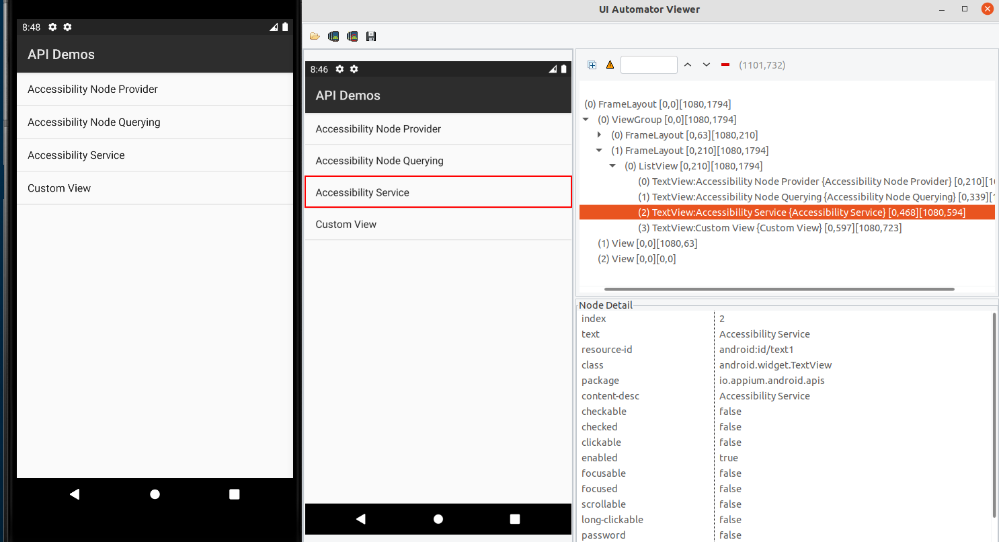

<br/>

🔶 By `Appium Inspector`

(1) Set **environment variables** first (if not already done) with `Edit Configuration` option.

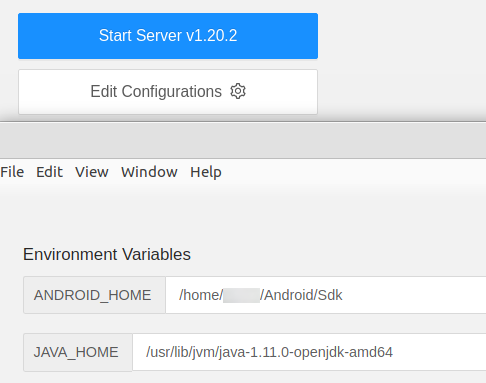

(2) Start Appium server by clicking on `Start Server ...` button

(3) Start inspector by clicking on `Start Inspector Session` icon

(4) Open CMD/terminal and enter command:

```shell
adb devices
```

If everything is ok, you'll get something like:

```shell
List of devices attached
emulator-5554    device
```

(5) Enter desired capabilities for your emulator/device (*For the list of most important capabilities, see* [General Capabilities](https://appium.io/docs/en/writing-running-appium/caps/index.html#general-capabilities)). You <big>**must**</big> at least enter the following:

- `platformName`: Which mobile OS platform to use (`iOS`, `Android`, or `FirefoxOS`)
- `udid`: Unique device identifier of the connected physical device (*provided in step above*)
- `app`: The absolute local path *or* remote http URL to a `.ipa` file (IOS), `.app` folder (IOS Simulator), `.apk` file (Android) (`/abs/path/to/app.apk` or `http://myapp.com/app.apk`)

Optional capabilities:

- `platformVersion`: Mobile OS version
- `deviceName`: The kind of mobile device or emulator to use
- `automationName`: Which automation engine to use! `Appium` (default), or `UiAutomator2`, `Espresso`, or `UiAutomator1` for Android, or `XCUITest` or `Instruments` for iOS...

---

**Example** *with minimal and mandatory key-value pairs for Android app*:

```json
{
  "platformName": "Android",  
  "udid": "emulator-5554",
  "app": "/home/USER/IdeaProjects/appium-java-poc/app/TheApp-v1.9.0.apk"
}
```

---

If everything is OK, you'll get something like this:

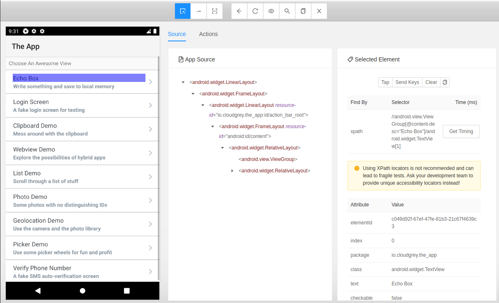

<br/>

### ...Step 5: Writing first test

todo

### ...Step 6: Running test(s)

todo

### ...Step 7: Tests results & reporting

...

<br/>

## ...Debugging mobile applications...

> Google Chrome's Developer Tools for remote debugging
> 
> Fiddler
> 
> ? Developer Assistant for native Android apps

...

### Debugging web/mobile app by Fiddler

> If you are from the software industry, chances are that you are already familiar with **Fiddler** which is used for **analytics** and **debugging** purposes. The tool offers powerful capabilities to capture traffic from almost any device. `m4`

Fiddler is a **web debugging** and **data monitoring tool**. Since this is a proxy tool, it can debug traffic from user machine, MAC system and mobile devices. You can use it to debug traffic from any application that supports Internet explorer, Opera, Firefox, Chrome, Safari or other browsers. It supports frameworks such as .NET, Java and Ruby, among others. `m4`

**How to capture traffic from mobiles (Android and iOS):** `m4`

1. Install Fiddler on your computer (desktop).
2. Go to Tools –> Fiddler Options -> Connections and tick the checkbox for ‘Allow remote computers to connect’.
3. On the mobile device, hit this URL in any browser http://ipv4.fiddler:8888/
4. Click on the link - Fiddler Root Certificate - and install it on the mobile device.
5. To configure device to use proxy, go to settings -> select Wi-Fi.
6. For Android devices, tap and hold the network that is connected. Select modify network from popup. Check mark the advanced option. Change Proxy setting to manual and add your computer's IP address in proxy hostname and proxy port set to 8888.
7. For iOS devices, select the network that currently connected. In HTTP proxy section, select the manual option and set server to your computer's IP address and port to 8888.
8. You can now see your application’s traffic on Fiddler.

**Use of fiddler:** `m4`

1. **Request/response check: -** Once you see the traffic in the web session pane of Fiddler, you can see request-response of different web services used in the application through the Inspector tab on the right hand side pane. It shows different inspectors such as JSON, XML. We can choose any of the inspectors to view data. The user can also view any bottleneck in request or response and track the issue.
2. **Comparison of two sessions: -** We can compare two sessions to see the difference. Select two sessions from the session pane, right click and choose the compare option. Fiddler uses the WinDiff tool to show comparisons. We can manually change it in the registry.
3. **Generate Request: -** The Compose tab of Fiddler can be used for this purpose. The user can generate request for application and execute it to see the response. The user can also save a session or its request/response and re-execute it for other purposes.
4. **API Testing:** - Web APIs can be tested by using the APITest extension of Fiddler. The APITest tab can be accessed by clicking on - View->Tabs->APITest. It shows a list of tests containing API request and validators. Validators provide information about success and failure of test performed.
5. **Statistics and timeline of session: -** The statistics tab shows overall performance metrics of selected session. It gives the number of request, sent and received bytes through sessions. Response bytes can be seen by content types or pie charts. Fiddler gives you information about the files used for generation of page in the selected session.

<br/>

---

> **Remote debugging** tools provide an interface to connect to a mobile device from a desktop computer. Doing this, you can debug for a mobile device using the development tools on a more powerful, easier-to-use desktop machine. `m5`
> 
> - With the release of iOS 6.0, Apple introduced a tool that enables you to use desktop Safari’s Web Inspector to debug iOS devices. To get started, enable remote debugging on your iOS device by going to “Settings” → “Safari” → “Advanced” and enabling “Web Inspector.”
> - Similar to iOS, Android has a **remote debugging solution**. First, go to “Settings” → “About Phone” on your Android 4.4+ phone (or “Settings” → “About Tablet”). Next, tap the “Build Number” seven (7) times. (No, I’m not joking. You’ll see a message about being a developer at the end.) Now, go back to the main settings and into “Developer Options.” Here, enable “USB debugging,” and you’re all set.

---

Any traditional web developer that transitions into the mobile arena will quickly learn that many of the common development tools they take for granted in the web world – are **inaccessible on mobile phones**. Even someone extremely familiar in the mobile space will need to debug their code on an actual device. No single tool or debugging technique will solve all your debugging needs. Just like traditional web development, a mobile developer needs to rely an entire arsenal of testing tools. Some mobile friendly debugging techniques we commonly use: `m4`

- Running [Firebug Lite](http://getfirebug.com/firebuglite) on a tablet. Excellent for some quick debugging, however the interface isn’t ideal for touch devices and isn’t as robust as the full Firebug experience.
- Utilizing “[about:debug](http://android.stackexchange.com/questions/5999/android-browsers-aboutdebug-what-do-those-settings-do)” in Android native browsers to activate additional debug options.
- Apply some helpful debug overlays using [jQuery](http://jquery.com/). Particularly helpful when debugging screen size variations between Android devices.

---

**Chrome’s Remote debugging** allows you to you connect your computer’s Chrome’s developer tools to your Android device running mobile Chrome. With this you have full access to the Chrome developer tools for your mobile browser! `m6`

- **Step 1: Find your mobile device using Chrome**! *Don’t see the developer options? Go to Settings > About phone and tap the Build Number a few times. You should get a prompt with the number of clicks left for you to “become a developer”*
  
  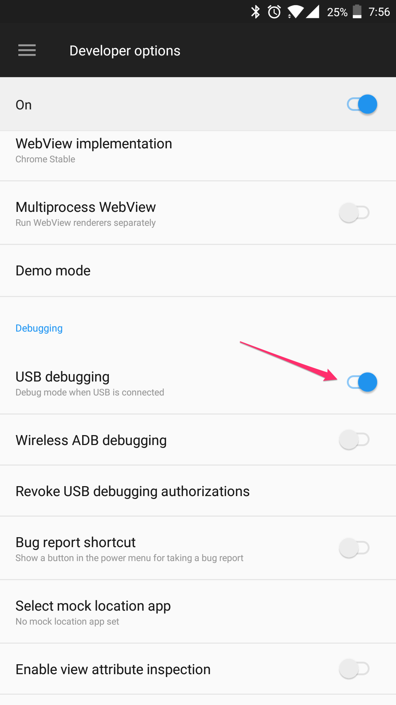

- On your computer, fire up Chrome, and then the developer tools (Cmd/Ctrl + Opt/Alt + i). On the row with the different tabs, click on the three dots on the right to load more options. There, under *More Tools,* you should find an option called *Remote Devices.*
  
  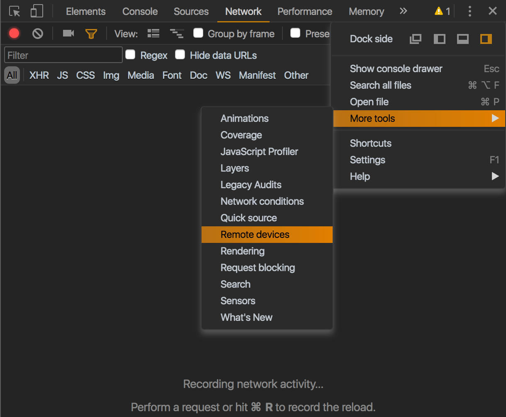

- Plug-in your mobile device to your computer; this would immediately throw an authorization prompt on it. Until you allow this, the device would be in a *Pending Authorization* state in the dev tools. Click on *OK.*
  
  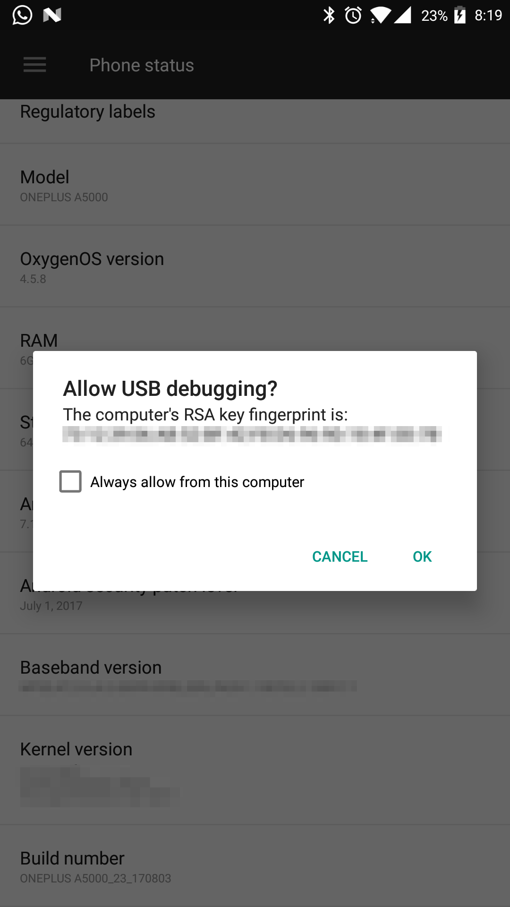

- The device is now authorized and ready to go! The Chrome developer tools should now list your device name and type.
  
  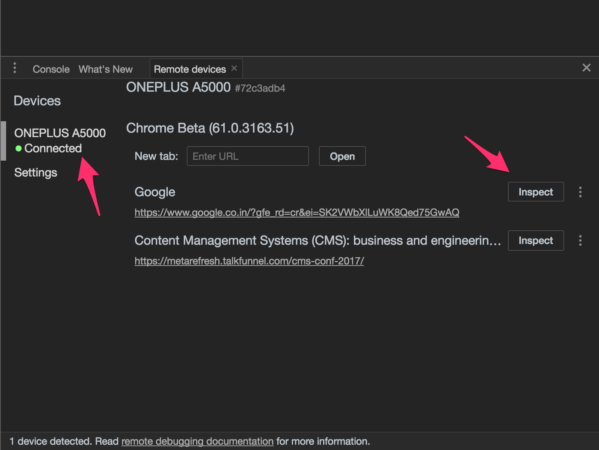

- **Step 2: Inspecting**: Once you’re done setting up, you can now inspect *tabs* directly on your computer’s Chrome!
  
  - Fire up Chrome on your mobile device.
  - Click on your device name in the chrome developer tools on your computer*.* It should list the different tabs that you’ve got open on your mobile device. Click on the *Inspect* button for the tab you want to debug.
  - Chrome should open up a new window, with a real-time version of your mobile browser’s tab on the left and all your regular developer tools on the right.
  
  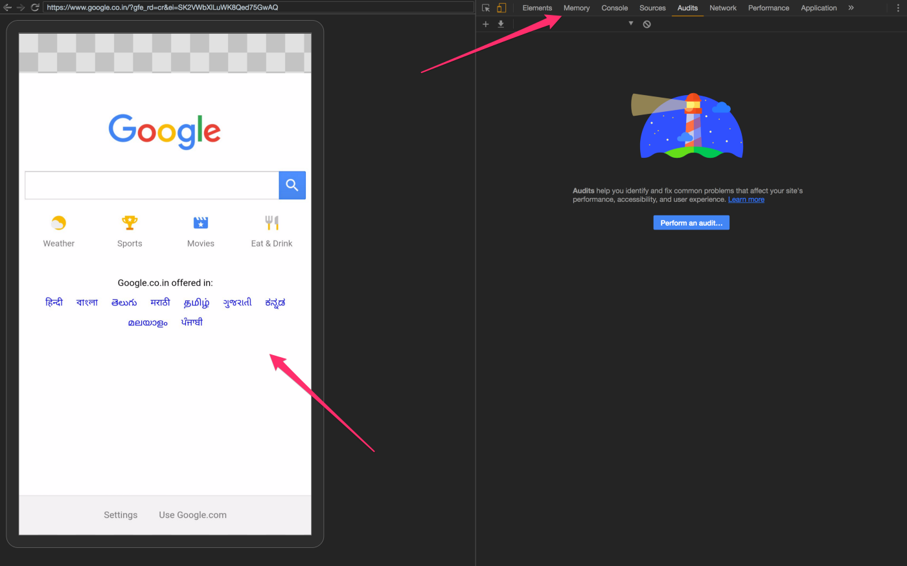

---

**Fiddler** is a powerful web debugging tool usable for multiple operating systems (Windows and Mac OS) and devices (PC and Mac). `m7`

A **proxy server** is an intermediary for requests which travel from client to server and vice-versa. A proxy can exist on the same machine as the client or server. It can also exist on a separate machine. This is the case for the setup we are going to use in the current context where we will have a client (mobile phone with an application we want to debug), a proxy server (our PC or Mac) and a Server (which communicates with the client). `m7`

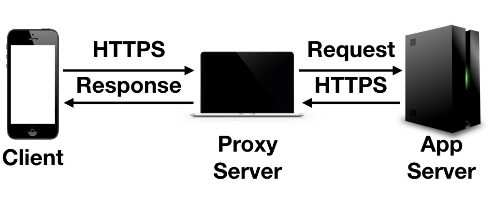

There are 2 types of proxies — **forward proxies** or **gateways** and **reverse proxies**. In the current context we will be using a **tunnelling proxy** or a **gateway** which basically gives us visibility to the request exchange between a mobile phone with a certain app using the internet and the server it communicates with. `m7`

**What we should do**

1. Install Java

2. Install Fiddler
   
   1. In order to decrypt https traffic, a few extra steps are required for both Windows and Mac users. You need to navigate to the “Tools -> Options…” menu. There you need to check the ‘Decrypt HTTPS traffic’ checkbox. Then you need to press the ‘Actions’ buttons. You should see this:
      
      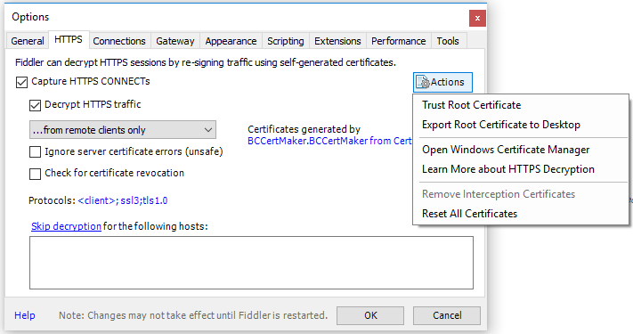
   
   2. On Windows, you need to click ‘**Trust Root Certificate**’ then accept to trust the fiddler certificate.
   
   3. One last step for both operating systems would be to import the exported Fiddler certificate into Mozilla’s trusted certificate section. To do this, simply open the Firefox ‘Certificate Manager’, navigate to the ‘Authorities’ section and import the Fiddler certificate. You should see this modal popping up:
      
      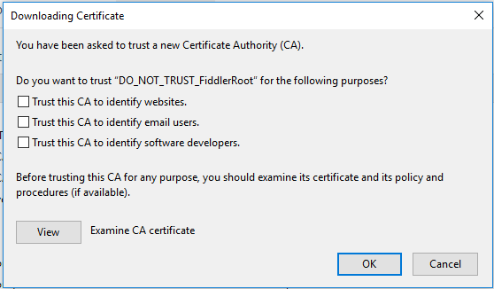

3. Setup the **Fiddler proxy** (phone and PC/Mac side)
   
   - In Fiddler, navigate to the ‘Connections’ section (“Tools -> Options…”)
   
   - Set a port you want to use (make sure it’s not something already in use)
   
   - Check the ‘Allow remote computers to connect’
   
   - Verify if everything so far was set correctly. If everything is in order, then by opening the following URL in your browser: myIP:setPort (example: http://172.19.221.49:8181/) you should see the Fiddler Echo service
     
     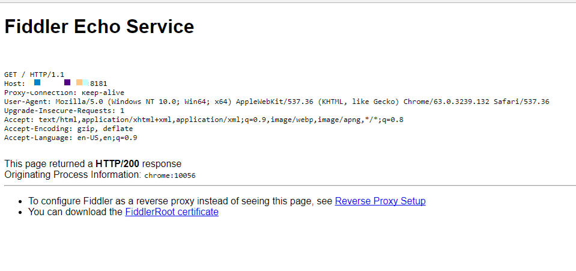
   
   - Access the same URL on the mobile phone you want to capture requests from
   
   - Tap the ‘**Fiddler root certificate**’ and install the certificate on Apple devices and download it on Android devices:
     
     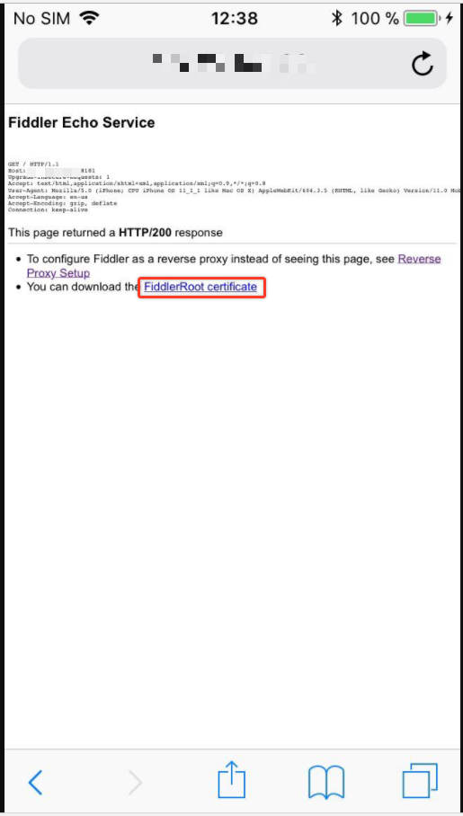
   
   - For Android phones, after you tap the ‘FiddlerRoot certificate’ you will probably get an installation error. You need to manually install it by navigating to the ‘Install certificates’ section in the ‘Certificate management’ screen. Tap ‘Install certificates’ and navigate to the folder where the root certificate was downloaded from the Fiddler echo page. Select the .cer file, name the certificate and tap ‘ok’.
   
   - Enable the certificate on Apple devices — these devices require one additional step where you need to the ‘Certificate trust settings’ and enable the freshly installed certificate:
     
     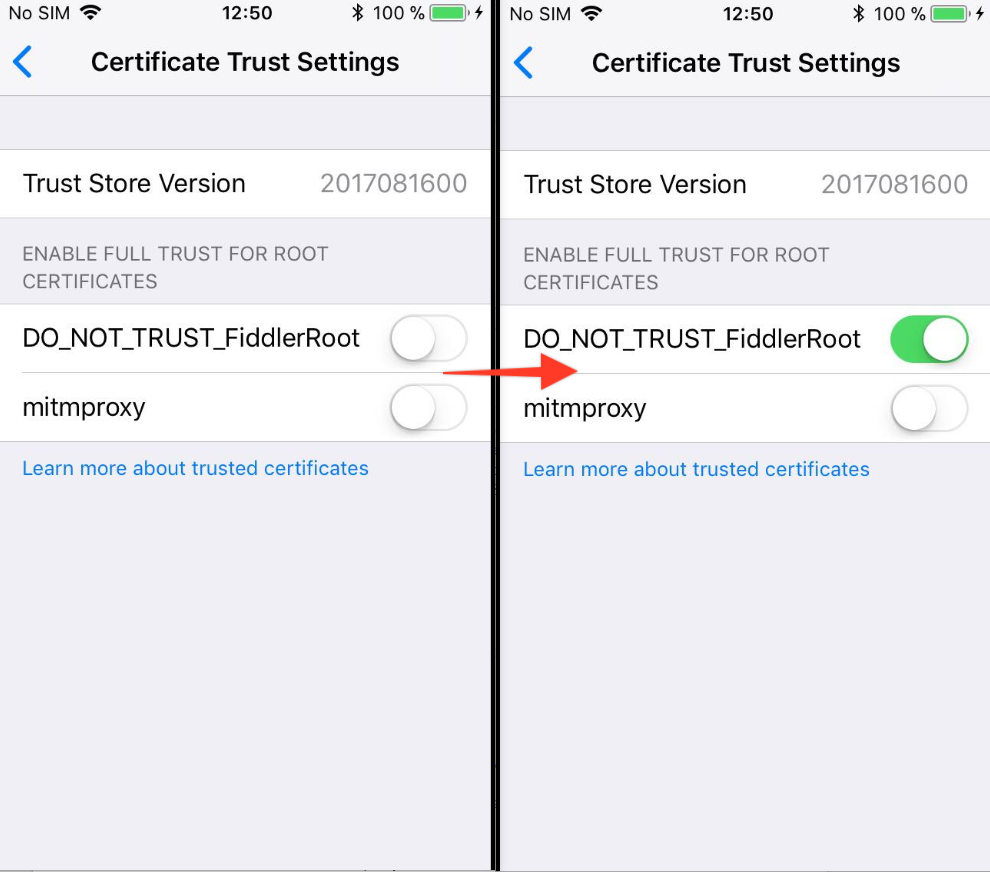
   
   - **Set a manual proxy:** This is the final step before we can actually start recording traffic going from and coming into our phones. Navigate to the ‘Wifi’ section, select your current wifi network and configure a manual proxy. The server field should be the IP address of your proxy server and the port should be the one which you set in Fiddler during the previous steps.
     
     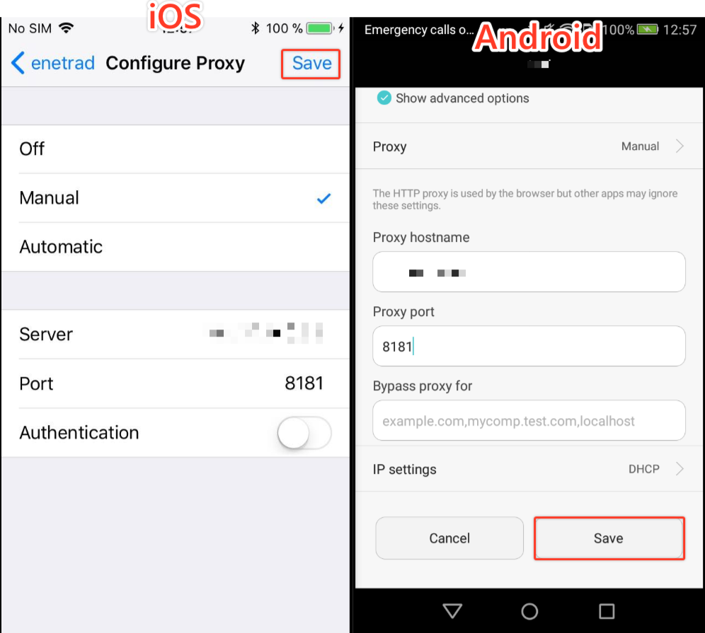

4. **Inspect requests**: After we performed all these steps, we can start debugging the requests from the mobile app we are interested in. *My suggestion would be to set a filter on Fiddler to only display requests from a certain domain. If we do this, we avoid cluttering the workspace and getting overwhelmed by too many displayed requests (since Fiddler will capture all requests ingoing from our phone).*
   
   - To set a filter, navigate to the ‘Filters’ tab, check the ‘Use filters’ option and check the ‘Show only if URL contains’ where we can set the domain name or part of the domain. Below you can see the required settings:
     
     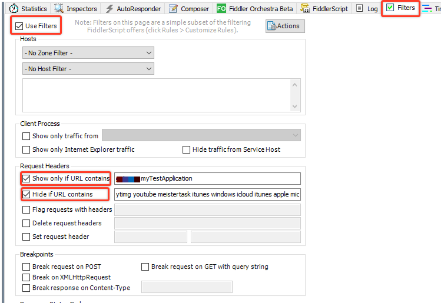

<br/>
>>>>>>> creating-first-specs
